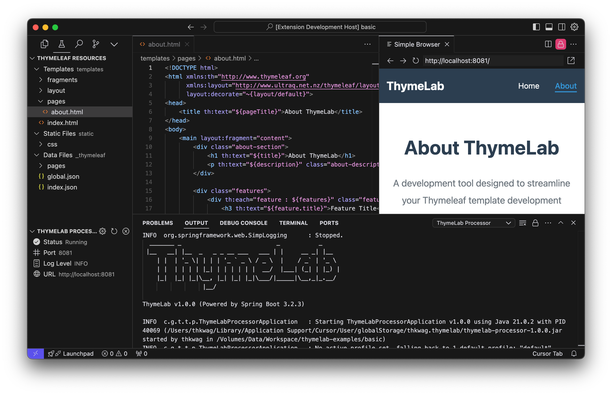

# ThymeLab - Thymeleaf Templates, Instantly Previewed

> **Note**: This extension is currently under development and not yet available on the VS Code Marketplace.

<p align="center">
  
</p>

<h3 align="center">Thymeleaf Template Previewer for VS Code</h3>

<p align="center">
  Instantly preview and test your Thymeleaf templates without setting up a Spring Boot application.
</p>

<p align="center">
  <a href="https://marketplace.visualstudio.com/items?itemName=thkwag.thymelab">
    
  </a>
  <a href="https://marketplace.visualstudio.com/items?itemName=thkwag.thymelab">
    
  </a>
  <a href="https://github.com/thkwag/thymelab/blob/main/LICENSE">
    
  </a>
</p>

<p align="center">
  
</p>

## ✨ Features

- 🚀 **Instant Preview**: See your template changes in real-time
- 📝 **Thymeleaf Support**: Full Thymeleaf syntax support with auto-completion
- 🔄 **Hot Reload**: Changes are reflected without server restart
- 📊 **JSON Data**: Test templates with JSON test data
- 🎨 **Static Resources**: Serve CSS, JS, images, and more
- 📁 **Layout System**: Support for Thymeleaf layout system

## 🚀 Getting Started

1. Install ThymeLab extension from VS Code Marketplace
2. Configure settings as described below
   - If `thymelab.processor.jarPath` is left empty, the extension will automatically download the latest processor JAR file from GitHub releases
   - Or you can manually download and specify the path to the JAR file

## ⚙️ Configuration

### Processor Settings

| Setting | Description | Default | Required |
|---------|-------------|---------|----------|
| `thymelab.processor.jarPath` | Path to ThymeLab processor JAR file. Leave empty for auto-download | - | |
| `thymelab.processor.javaHome` | Path to Java executable | System Java | |
| `thymelab.processor.port` | Server port number | 8080 | |
| `thymelab.processor.logLevel` | Log level (ERROR, WARN, INFO, DEBUG, TRACE) | INFO | |

### Resource Settings

| Setting | Description | Example |
|---------|-------------|---------|
| `thymelab.resources.templatePath` | Directory for Thymeleaf templates | `src/main/resources/templates` |
| `thymelab.resources.staticPath` | Directory for static resources | `src/main/resources/static` |
| `thymelab.resources.dataPath` | Directory for JSON data files | `src/main/resources/thymelab/data` |

## 🎯 VS Code Interface

### Activity Bar
- 🧪 **ThymeLab Icon**: Click to show/hide ThymeLab panel
- ⚙️ **Settings**: Click to open VS Code settings

### Server Panel
- **Status**: Shows if server is Starting/Running/Stopped
- **Port**: Current port number (click gear icon to change)
- **Log Level**: Current log level (click gear icon to change)
- **URL**: Server URL (click browser icon for internal, external link icon for external browser)

### Server Controls
- **Start**: Start server (available when stopped)
- **Stop**: Stop server (available when running)
- **Restart**: Restart server (available when running)
- **Refresh**: Refresh view (always available)

## 📁 Directory Structure

```
your-project/
  ├── templates/     # Thymeleaf template files (.html)
  ├── static/        # Static files (CSS, JS, images, etc.)
  └── thymelab/data/ # Thymeleaf data files (.json)
```

## 🎮️ Preview Options

### Internal Browser
Click the browser icon or URL to open the preview in VS Code's right panel.

### External Browser
Click the external link icon to open in your system's default browser.

## 🛠 Troubleshooting

### Common Issues
1. **Server won't start**
   - Verify JAR file path is correct
   - Check if Java is installed
   - Ensure port is available
   - Make sure all required directories are set

2. **Templates not loading**
   - Check if files are in correct directory
   - Verify file extension is .html
   - Confirm server is running

3. **Changes not reflecting**
   - Make sure files are saved
   - Try restarting server

### Error Messages
- "JAR file not found": Set correct path in settings or let the extension download it automatically
- "Port already in use": Change port number in settings
- "Java not found": Install Java or set Java home path
- "Required directories not set": Configure template, static, and data directories

## 👥 Contributing

Please see our [Development Guide](docs/development-guide.md) for setup instructions and contribution guidelines.

## License

This project is licensed under the MIT License - see the [LICENSE](LICENSE) file for details.
* ThymeLab logo <a href="https://www.flaticon.com/free-icon/flask_11920002">icon</a> made by <a href="https://www.freepik.com">Freepik</a> from <a href="https://www.flaticon.com">Flaticon</a>